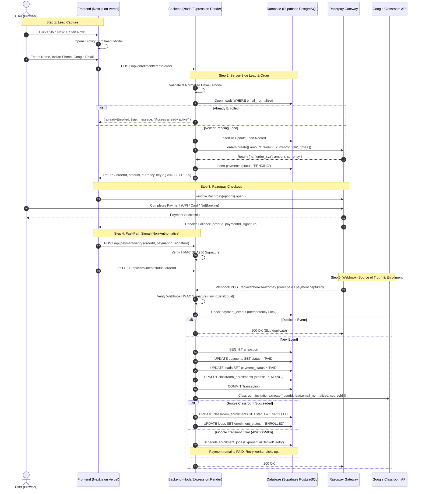

# Super Profit — Production Enrollment & Payment System Architecture

## 1. Architecture Diagram



---

## 2. Files Created & Modified

### Modified Files:
- [`frontend/app/page.tsx`](file:///d:/CCP/frontend/app/page.tsx): Mounted `<EnrollmentModal />` seamlessly inside page layout.
- [`frontend/components/CTAButton.tsx`](file:///d:/CCP/frontend/components/CTAButton.tsx): Added `"use client"`, `onClick` prop, and `data-enroll-btn` trigger.
- [`frontend/components/BonusesSection.tsx`](file:///d:/CCP/frontend/components/BonusesSection.tsx): Added `"use client"` and `data-enroll-btn` to "Start Now" button.

### Created Files:
- [`frontend/components/EnrollmentModal.tsx`](file:///d:/CCP/frontend/components/EnrollmentModal.tsx): Complete enrollment modal matching design system, validation, dynamic Razorpay checkout loading, fast-path verification, and live polling.
- [`frontend/.env.example`](file:///d:/CCP/frontend/.env.example): Frontend environment variable documentation.
- [`backend/package.json`](file:///d:/CCP/backend/package.json): Node.js + Express + TypeScript stack configuration.
- [`backend/tsconfig.json`](file:///d:/CCP/backend/tsconfig.json): TypeScript build settings.
- [`backend/vitest.config.ts`](file:///d:/CCP/backend/vitest.config.ts): Unit and integration test runner setup.
- [`backend/.env.example`](file:///d:/CCP/backend/.env.example): Production environment variable documentation.
- [`backend/migrations/001_initial_schema.sql`](file:///d:/CCP/backend/migrations/001_initial_schema.sql): PostgreSQL schema with tables, constraints, indexes, triggers, and Row Level Security.
- [`backend/src/config/env.ts`](file:///d:/CCP/backend/src/config/env.ts): Zod-validated environment configuration.
- [`backend/src/db/pool.ts`](file:///d:/CCP/backend/src/db/pool.ts): Connection pool and atomic database transaction helper.
- [`backend/src/utils/logger.ts`](file:///d:/CCP/backend/src/utils/logger.ts): Structured JSON logger with email masking and automatic secret redaction.
- [`backend/src/utils/validation.ts`](file:///d:/CCP/backend/src/utils/validation.ts): Zod validation schemas for Name, Indian Phone (10 digits), and Google Email.
- [`backend/src/services/leadService.ts`](file:///d:/CCP/backend/src/services/leadService.ts): Lead creation, access checking, and status lookup.
- [`backend/src/services/razorpayService.ts`](file:///d:/CCP/backend/src/services/razorpayService.ts): Server-side order creation, HMAC signature verification, and webhook signature verification with `timingSafeEqual`.
- [`backend/src/services/googleClassroomService.ts`](file:///d:/CCP/backend/src/services/googleClassroomService.ts): Google OAuth2 client, course check, student invitations, student removal, and transient error classification.
- [`backend/src/services/enrollmentWorkflowService.ts`](file:///d:/CCP/backend/src/services/enrollmentWorkflowService.ts): Atomic payment state updates, Google Classroom enrollment trigger, attempt logging, and refund handling.
- [`backend/src/services/webhookService.ts`](file:///d:/CCP/backend/src/services/webhookService.ts): Authoritative idempotent Razorpay webhook handling (`order.paid`, `payment.captured`, `payment.failed`, `refund.processed`).
- [`backend/src/services/retryWorker.ts`](file:///d:/CCP/backend/src/services/retryWorker.ts): Database-backed background worker with exponential backoff for transient Google Classroom errors.
- [`backend/src/middleware/rateLimiter.ts`](file:///d:/CCP/backend/src/middleware/rateLimiter.ts): Rate limiters for orders, verification, and general endpoints.
- [`backend/src/routes/enrollmentRoutes.ts`](file:///d:/CCP/backend/src/routes/enrollmentRoutes.ts): `POST /api/enrollment/create-order` & `GET /api/enrollment/status/:orderId`.
- [`backend/src/routes/paymentRoutes.ts`](file:///d:/CCP/backend/src/routes/paymentRoutes.ts): `POST /api/payment/verify`.
- [`backend/src/routes/webhookRoutes.ts`](file:///d:/CCP/backend/src/routes/webhookRoutes.ts): `POST /api/webhooks/razorpay`.
- [`backend/src/app.ts`](file:///d:/CCP/backend/src/app.ts): Express application setup with Helmet, CORS, and rawBody webhook parser.
- [`backend/src/server.ts`](file:///d:/CCP/backend/src/server.ts): Server listener, retry worker startup, and graceful shutdown.
- [`backend/tests/validation_and_flow.test.ts`](file:///d:/CCP/backend/tests/validation_and_flow.test.ts): 8 unit tests for input normalization, HMAC crypto, and transient error checks.
- [`backend/tests/integration.test.ts`](file:///d:/CCP/backend/tests/integration.test.ts): 7 integration tests for Express API endpoints, signature validation, and webhook idempotency.

---

## 3. Database Schema (`001_initial_schema.sql`)

### Tables:
1. **`leads`**:
   - `id`: UUID (PK, default `gen_random_uuid()`)
   - `full_name`: VARCHAR(255)
   - `phone`: VARCHAR(50)
   - `email`: VARCHAR(255)
   - `email_normalized`: VARCHAR(255) (Indexed)
   - `payment_status`: VARCHAR(50) (`PENDING`, `PAID`, `FAILED`, `REFUNDED`)
   - `enrollment_status`: VARCHAR(50) (`PENDING`, `ENROLLED`, `FAILED`, `REMOVAL_PENDING`, `REMOVED`)
   - `razorpay_customer_id`: VARCHAR(100)
   - `latest_order_id`: VARCHAR(100) (Indexed)
   - `google_classroom_course_id`: VARCHAR(100)
   - `google_classroom_user_id`: VARCHAR(255)
   - `created_at`, `updated_at`: TIMESTAMPTZ

2. **`payments`**:
   - `id`: UUID (PK)
   - `lead_id`: UUID (FK -> leads.id ON DELETE CASCADE)
   - `razorpay_order_id`: VARCHAR(100) (UNIQUE, Indexed)
   - `razorpay_payment_id`: VARCHAR(100) (UNIQUE, Indexed)
   - `amount`: INTEGER (in paise, > 0)
   - `currency`: VARCHAR(10) (DEFAULT 'INR')
   - `status`: VARCHAR(50) (`PENDING`, `PAID`, `FAILED`, `REFUNDED`)
   - `signature`: VARCHAR(255)
   - `paid_at`: TIMESTAMPTZ
   - `created_at`, `updated_at`: TIMESTAMPTZ

3. **`payment_events`** (Webhook Idempotency):
   - `id`: UUID (PK)
   - `event_id`: VARCHAR(255) (UNIQUE, Indexed)
   - `event_type`: VARCHAR(100)
   - `payload_hash`: VARCHAR(64)
   - `processed`: BOOLEAN (DEFAULT FALSE)
   - `processed_at`: TIMESTAMPTZ
   - `created_at`: TIMESTAMPTZ

4. **`classroom_enrollments`**:
   - `id`: UUID (PK)
   - `lead_id`: UUID (FK -> leads.id)
   - `course_id`: VARCHAR(100)
   - `google_email`: VARCHAR(255) (Indexed)
   - `google_user_id`: VARCHAR(255)
   - `invitation_id`: VARCHAR(255)
   - `status`: VARCHAR(50) (`PENDING`, `ENROLLED`, `FAILED`, `REMOVAL_PENDING`, `REMOVED`)
   - `attempt_count`: INTEGER (DEFAULT 0)
   - `last_error_code`: VARCHAR(100)
   - `last_error_message`: TEXT
   - `enrolled_at`, `removed_at`: TIMESTAMPTZ
   - `created_at`, `updated_at`: TIMESTAMPTZ
   - CONSTRAINT: `UNIQUE (lead_id, course_id)`

5. **`enrollment_attempts`** (Diagnostic Logs):
   - `id`: UUID (PK)
   - `enrollment_id`: UUID (FK -> classroom_enrollments.id)
   - `attempt_number`: INTEGER
   - `status`: VARCHAR(50)
   - `error_code`: VARCHAR(100)
   - `error_message`: TEXT
   - `created_at`: TIMESTAMPTZ

6. **`enrollment_jobs`** (Retry Queue):
   - `id`: UUID (PK)
   - `enrollment_id`: UUID (FK -> classroom_enrollments.id)
   - `action`: VARCHAR(50) (`ENROLL`, `REMOVE`)
   - `status`: VARCHAR(50) (`PENDING`, `PROCESSING`, `COMPLETED`, `FAILED`)
   - `next_run_at`: TIMESTAMPTZ (Indexed)
   - `attempts`: INTEGER (DEFAULT 0)
   - `max_attempts`: INTEGER (DEFAULT 5)
   - `last_error`: TEXT
   - `created_at`, `updated_at`: TIMESTAMPTZ

---

## 4. API Endpoints

| Method | Endpoint | Description | Auth / Rate Limit |
|---|---|---|---|
| `GET` | `/health` | Health check probe | Public |
| `POST` | `/api/enrollment/create-order` | Validates lead, creates Razorpay order server-side | 15 req / 15 min per IP |
| `GET` | `/api/enrollment/status/:orderId` | Non-sensitive polling status for checkout modal | Public |
| `POST` | `/api/payment/verify` | Server-side HMAC SHA-256 signature verification | 30 req / 15 min per IP |
| `POST` | `/api/webhooks/razorpay` | Authoritative Razorpay webhook listener | HMAC `x-razorpay-signature` |

---

## 5. Security & Anti-Sharing Checklist

- [x] **No Class Code Exposure**: Course class code is never shown on the website or frontend source.
- [x] **Server-Configured Course ID**: `GOOGLE_CLASSROOM_COURSE_ID` is stored purely in backend environment variables.
- [x] **No Secrets in Frontend**: `RAZORPAY_KEY_SECRET`, `GOOGLE_CLIENT_SECRET`, and `GOOGLE_REFRESH_TOKEN` remain strictly on the Render backend.
- [x] **Canonical Paid Email**: Only `lead.email_normalized` from the original checkout submission is invited to Google Classroom. Users cannot provide a different email after payment.
- [x] **Webhook as Source of Truth**: Access is confirmed via Razorpay webhook; client-side callbacks are treated as UX hints only.
- [x] **Timing-Safe HMAC Verification**: `crypto.timingSafeEqual` prevents side-channel timing attacks on signatures.
- [x] **Database Idempotency**: `payment_events.event_id` unique constraint prevents duplicate webhooks from initiating duplicate enrollments.
- [x] **Separate State Transitions**: Payment status = `PAID` is preserved even if the Google Classroom API is temporarily unavailable; the database retry worker resumes enrollment automatically.
- [x] **Automatic Student Revocation on Refund**: `refund.processed` / `payment.refunded` webhooks automatically transition status to `REFUNDED` and trigger `removeStudent` in Google Classroom.

---

## 6. Production Setup Guide

### A. Supabase Database Migration
1. Go to your Supabase Project Dashboard -> **SQL Editor**.
2. Open [`backend/migrations/001_initial_schema.sql`](file:///d:/CCP/backend/migrations/001_initial_schema.sql).
3. Paste and click **Run**.
4. Copy the connection string under **Project Settings -> Database -> Connection URI** (e.g., `postgresql://postgres:[PASSWORD]@[HOST]:5432/postgres?sslmode=require`).

### B. Google Cloud & Google Classroom Setup
1. Open [Google Cloud Console](https://console.cloud.google.com).
2. Create project: **Super Profit Education**.
3. Enable API: **Google Classroom API**.
4. Configure OAuth Consent Screen:
   - User Type: External (or Internal if using Google Workspace).
   - Scopes required:
     - `https://www.googleapis.com/auth/classroom.rosters` (to invite and manage students)
     - `https://www.googleapis.com/auth/classroom.profile.emails` (to view student email addresses)
     - `https://www.googleapis.com/auth/classroom.courses.readonly`
5. Create OAuth 2.0 Credentials:
   - Application Type: Web application.
   - Authorized redirect URI: `https://developers.google.com/oauthplayground` (to generate initial refresh token for course owner/teacher account).
6. Obtain `GOOGLE_REFRESH_TOKEN` using OAuth Playground:
   - Enter Client ID & Secret in OAuth Playground settings.
   - Select Classroom scopes above.
   - Authorize with the teacher/admin Google account that created the Classroom course.
   - Exchange authorization code for tokens and save the **Refresh Token**.
7. Create the Google Classroom course:
   - Go to [classroom.google.com](https://classroom.google.com).
   - Create the course (e.g. "Super Profit UGC Masterclass").
   - Extract the numeric course ID from the URL (e.g., `https://classroom.google.com/c/123456789012` -> `123456789012`).

### C. Razorpay Gateway Setup
1. Sign in to [Razorpay Dashboard](https://dashboard.razorpay.com).
2. Generate API Keys: **Settings -> API Keys** -> copy Key ID and Key Secret.
3. Configure Webhook:
   - **Settings -> Webhooks -> Add New Webhook**.
   - Webhook URL: `https://your-backend.onrender.com/api/webhooks/razorpay`
   - Secret: Generate a strong random string (e.g., 32 hex chars).
   - Active Events:
     - `order.paid`
     - `payment.captured`
     - `payment.failed`
     - `refund.created`
     - `refund.processed`
     - `payment.refunded`

### D. Render Deployment (Backend)
1. In Render Dashboard, click **New Web Service**.
2. Connect your Git repository, set **Root Directory** to `backend`.
3. Build Command: `npm install && npm run build`
4. Start Command: `npm start`
5. Environment Variables:
   ```env
   NODE_ENV=production
   PORT=5000
   DATABASE_URL=postgresql://postgres:[PASSWORD]@[HOST]:5432/postgres?sslmode=require
   FRONTEND_URL=https://your-frontend.vercel.app
   RAZORPAY_KEY_ID=rzp_live_xxxxxxxxxxxxxx
   RAZORPAY_KEY_SECRET=xxxxxxxxxxxxxxxxxxxxxxxx
   RAZORPAY_WEBHOOK_SECRET=xxxxxxxxxxxxxxxxxxxxxxxx
   COURSE_PRICE_PAISE=349900
   COURSE_CURRENCY=INR
   GOOGLE_CLIENT_ID=xxxxxxxxxxxx.apps.googleusercontent.com
   GOOGLE_CLIENT_SECRET=GOCSPX-xxxxxxxxxxxxxxxxxxxxxxxx
   GOOGLE_REFRESH_TOKEN=1//0gxxxxxxxxxxxxxxxxxxxxxxxxxxxxxxxx
   GOOGLE_CLASSROOM_COURSE_ID=123456789012
   ```

### E. Vercel Deployment (Frontend)
1. In Vercel Dashboard, import the Git repository.
2. Set **Root Directory** to `frontend`.
3. Framework Preset: **Next.js**.
4. Build Command: `npm run build`
5. Environment Variables:
   ```env
   NEXT_PUBLIC_BACKEND_URL=https://your-backend.onrender.com
   ```
6. Deploy!
